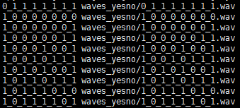
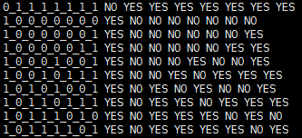
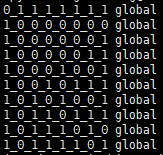

# Step-by-Step(YesNo)
## Assumpation
- This blog assuming kaldi have been install succeed.
## Introduction
- **conf**
    - mfcc.conf : config related to compute mfcc
    - topo_orig.proto : HMM topology
- **input**
    - lexicon_nosil.txt : lexicon(word to phone) exclude silence
    - lexicon.txt : lexicon(word to phone) include silence
    - phones : complete phone list
    - task.arpabo : 1-gram language model
- **local**
    - create_yesno_txt.pl : generate text
    - create_yesno_wav_scp.pl : generate scp
    - create_yesno_waves_test_train.pl : split dataset
    - prepare_data.sh : generate wav.scp, text, utt2spk, spk2utt
    - prepare_dict.sh : generate dict
    - prepare_lm.sh : generate G.fst
    - score.sh : calculate wer
- **other**
    - path.sh : set enviroment variable
    - run.sh : top-level entry
    - steps : `todo`
    - utils : `todo`
## Steps
- **step-1** : download data(line 6 to 11)
- **step-2** : prepare_data(line 20), generate wav.scp, text, utt2spk, spk2utt
    - 
    - 
    - 
    - 
## Questions
- TODO